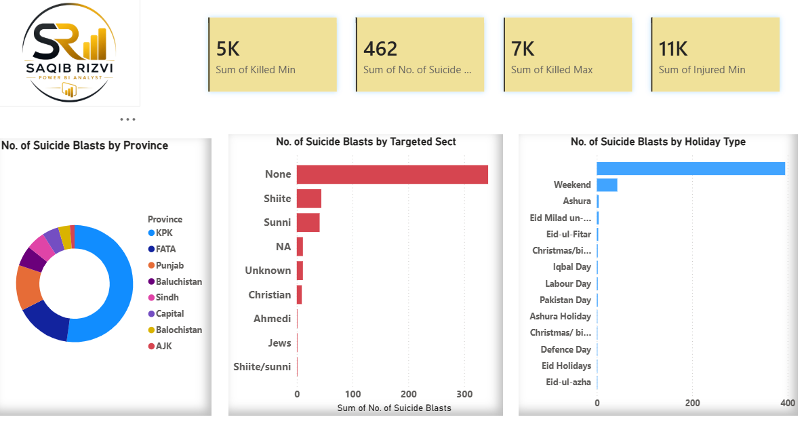

# Pakistan-Suicide-Attacks-Analysis
Interactive Power BI dashboard analyzing suicide attacks in Pakistan, including sect-wise targeting, provincial distribution, and holiday-related attack patterns.

# Pakistan Suicide Attacks Analysis Dashboard

## Dashboard Preview

## Project Overview

This Power BI dashboard provides an analytical overview of suicide attacks in Pakistan. The project explores attack patterns, targeted sects, provincial distribution, and the relationship between attacks and different holiday types.

## Objectives

* Analyze the frequency of suicide attacks.
* Identify the most affected provinces.
* Examine attacks against different sectarian groups.
* Explore attack patterns across various holiday categories.
* Present insights through interactive visualizations.

## Tools Used

* Microsoft Power BI
* Power Query
* DAX
* Microsoft Excel

## Skills Demonstrated

* Data Cleaning
* Data Transformation
* Data Analysis
* Data Visualization
* Dashboard Development
* Data Modeling
* Report Design

## Dashboard Features

* Total Suicide Attacks Overview
* Province-wise Attack Analysis
* Sect-wise Target Analysis
* Holiday Type Analysis
* Interactive Filters and Slicers

## Key Insights

* Identified provinces with the highest number of suicide attacks.
* Analyzed patterns of attacks against targeted sects.
* Examined the distribution of attacks across different holiday categories.
* Highlighted trends through interactive visualizations.

## Files Included

* Pakistan Suicide Attacks Dashboard.pbix
* Dataset.xlsx
* Dashboard-image.png

## Data Source

* This project uses a publicly available dataset obtained from Kaggle.

* Dataset: Pakistan Suicide Bombing Attacks

* Source:
  https://www.kaggle.com/datasets/zusmani/pakistansuicideattacks/discussion/39596
